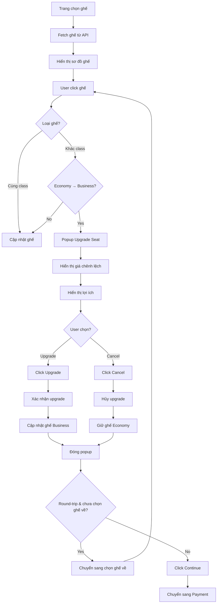
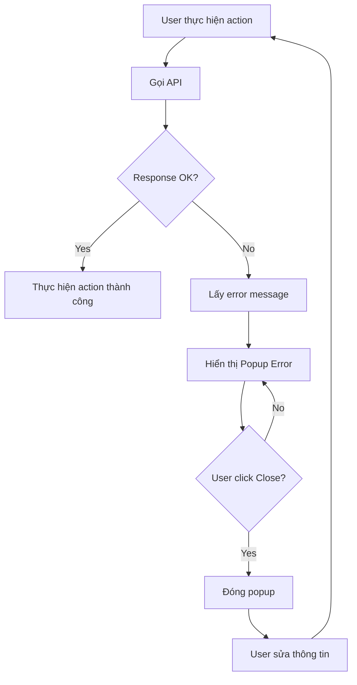

# Tripma Flight Booking - System Documentation

## Table of Contents
1. [Routes Mapping](#routes-mapping)
2. [Actors and Roles](#actors-and-roles)
3. [Screen Functionality](#screen-functionality)
4. [User Flows](#user-flows)
5. [Flow Diagrams](#flow-diagrams)
6. [API Endpoints](#api-endpoints)
7. [Database Schema](#database-schema)

---

## Routes Mapping

### Implemented Routes

| STT | Màn hình | Route | Loại | Trạng thái | File Path |
|-----|----------|-------|------|------------|-----------|
| 1 | Trang chủ | `/` | Page | Đã hoàn thiện | `app/page.js` |
| 2 | Kết quả tìm chuyến | `/flights` | Page | Đã hoàn thiện | `app/flights/page.js` |
| 3 | Đặt vé - Hành khách | `/booking` (sub-view) | Sub-view | Đã hoàn thiện | `app/booking/passenger.js` |
| 4 | Đặt vé - Chọn ghế | `/booking` (sub-view) | Sub-view | Đã hoàn thiện | `app/booking/selectseats.js` |
| 5 | Đặt vé - Upgrade Seat | `/booking` (popup) | Popup | Triển khai một phần | `app/booking/selectseats.js` |
| 6 | Đặt vé - Thanh toán | `/booking` (sub-view) | Sub-view | Đã hoàn thiện | `app/booking/payment.js` |
| 7 | Đặt vé - Popup xử lý/lỗi | `/booking` (modal) | Modal | Đã hoàn thiện | `app/booking/page.js` |
| 8 | Xác nhận đặt vé | `/successbooking` | Page | Đã hoàn thiện | `app/successbooking/page.js` |
| 9 | Modal sign up | Overlay | Modal | Đã hoàn thiện | `components/Authentication/authenticate.js` |
| 10 | Modal sign in | Overlay | Modal | Đã hoàn thiện | `components/Authentication/authenticate.js` |

### Not Implemented Routes (404)

| STT | Màn hình | Route | Loại | Trạng thái | Ghi chú |
|-----|----------|-------|------|------------|---------|
| 11 | Hotels | `/hotels` | Page | Chưa triển khai | Chỉ link trên navbar |
| 12 | Packages | `/packages` | Page | Chưa triển khai | Chỉ link trên navbar |
| 13 | Your trips | `/packages` (duplicate) | Page | Chưa triển khai | Chỉ link trên navbar khi logged in |

---

## Actors and Roles

### 1. Guest User (Người dùng chưa đăng nhập)
- **Quyền hạn:**
  - Xem trang chủ
  - Tìm kiếm chuyến bay
  - Xem danh sách chuyến bay
  - Đặt vé (không cần đăng nhập)
  - Xem flight deals và unique places
  - Đăng ký tài khoản mới
  - Đăng nhập

### 2. Authenticated User (Người dùng đã đăng nhập)
- **Quyền hạn:**
  - Tất cả quyền của Guest User
  - Xem lịch sử đặt vé (Your Trips - chưa triển khai)
  - Lưu thông tin đặt vé vào tài khoản
  - Nhận deal alerts (nếu đăng ký)
  - Đăng xuất

### 3. Admin (Quản trị viên - chưa triển khai rõ ràng)
- **Quyền hạn (dự kiến):**
  - Quản lý chuyến bay
  - Quản lý ghế ngồi
  - Xem tất cả đặt vé
  - Quản lý người dùng

---

## Screen Functionality

### 1. Trang chủ (`/`)
**File:** `app/page.js`

**Chức năng:**
- Hiển thị hero banner với slogan "It's more than just a trip"
- Form tìm kiếm chuyến bay:
  - Chọn thành phố đi/đến
  - Chọn ngày đi/về (one-way hoặc round-trip)
  - Chọn số lượng hành khách (adults, children)
- Cookie popup (xuất hiện lần đầu, có thể đóng)
- Flight deals section - hiển thị các ưu đãi chuyến bay
- Unique places section - hiển thị các địa điểm độc đáo
- Testimonials section - đánh giá từ khách hàng
- Footer với các link và thông tin

**Component chính:**
- `SelectionInputs` - Form tìm kiếm
- `CookiePopup` - Popup cookie
- `FlightDeals` - Section ưu đãi
- `CommentSection` - Đánh giá khách hàng

---

### 2. Kết quả tìm chuyến (`/flights`)
**File:** `app/flights/page.js`

**Chức năng:**
- Hiển thị danh sách chuyến bay dựa trên tham số tìm kiếm
- Bộ lọc chuyến bay:
  - Lọc theo giá tối đa
  - Lọc theo thời gian khởi hành/đến
  - Lọc theo hãng hàng không
- Hiển thị chuyến đi và chuyến về (nếu round-trip)
- Chọn chuyến bay (tối đa 2 chuyến cho round-trip)
- Hiển thị gợi ý hotel và flight deals
- Điều hướng đến trang đặt vé khi chọn chuyến

**Luồng hoạt động:**
1. Lấy tham số tìm kiếm từ localStorage
2. Gọi API `/api/flights` với tham số
3. Hiển thị danh sách chuyến bay
4. User chọn chuyến đi → lưu vào selectedFlights
5. Nếu round-trip → chuyển sang phase "returning"
6. User chọn chuyến về → lưu vào selectedFlights
7. Click "Continue" → lưu chuyến vào localStorage → redirect `/booking`

**Component chính:**
- `SelectionInputs` - Form tìm kiếm (có thể chỉnh sửa)
- `FilterComponent` - Bộ lọc
- `FlightReservation` - Danh sách chuyến bay
- `FlightDeals` - Gợi ý hotel/deals

---

### 3. Đặt vé - Hành khách (`/booking` - Passenger Page)
**File:** `app/booking/passenger.js`

**Chức năng:**
- Nhập thông tin hành khách:
  - Tên, tên đệm, họ, hậu tố
  - Ngày sinh
  - Email
  - Số điện thoại
  - Redress number (tùy chọn)
  - Known traveler number (tùy chọn)
- Nhập thông tin liên hệ khẩn cấp:
  - Tên, email, số điện thoại
- Chọn số lượng hành lý checked bags
- Tùy chọn "Same as passenger" cho thông tin liên hệ khẩn cấp
- Hiển thị tóm tắt chuyến bay đã chọn
- Validation form trước khi tiếp tục

**Validation:**
- Các trường bắt buộc phải được điền
- Email phải hợp lệ
- Số điện thoại phải hợp lệ
- Ngày sinh phải hợp lệ

**Component chính:**
- `PassengerHeader` - Tiêu đề section
- `PassengerInfo` - Form nhập thông tin
- `Reservation` - Tóm tắt chuyến bay

---

### 4. Đặt vé - Chọn ghế (`/booking` - Seats Page)
**File:** `app/booking/selectseats.js`

**Chức năng:**
- Hiển thị sơ đồ ghế máy bay:
  - Economy class
  - Business class
- Hiển thị thông tin từng class:
  - Mô tả
  - Lợi ích (benefits)
- Chọn ghế cho chuyến đi
- Chọn ghế cho chuyến về (nếu round-trip)
- Hiển thị thông tin hành khách và ghế đã chọn
- Popup upgrade seat khi chọn ghế Business từ Economy

**Luồng hoạt động:**
1. Fetch ghế từ API `/api/seats/[flightId]`
2. Hiển thị sơ đồ ghế Economy và Business
3. User chọn ghế:
   - Nếu chọn ghế cùng class → cập nhật ngay
   - Nếu chọn ghế Business từ Economy → hiển thị popup upgrade
4. Popup upgrade:
   - Hiển thị giá chênh lệch
   - User có thể xác nhận upgrade hoặc hủy
5. Sau khi chọn ghế chuyến đi → chuyển sang chọn ghế chuyến về (nếu có)
6. Click "Continue" → chuyển sang trang thanh toán

**Popup Upgrade Seat:**
- Hiển thị giá upgrade
- Mô tả lợi ích Business class
- Nút "Upgrade for $X" - xác nhận upgrade
- Nút "Cancel" - hủy upgrade

**Component chính:**
- `Seats` - Sơ đồ ghế
- `SeatClass` - Thông tin class
- `SeatDetails` - Chi tiết ghế đã chọn
- `ProgressStepHeader` - Thanh tiến trình

---

### 5. Đặt vé - Thanh toán (`/booking` - Payment Page)
**File:** `app/booking/payment.js`

**Chức năng:**
- Nhập thông tin thanh toán:
  - Tên trên thẻ
  - Số thẻ
  - Ngày hết hạn
  - CCV
- Hiển thị tóm tắt đặt chỗ:
  - Thông tin chuyến bay
  - Thông tin hành khách
  - Ghế đã chọn
  - Tổng giá (bao gồm thuế, phí hành lý, phí upgrade)
- Xử lý thanh toán:
  - Gọi API `/api/booking`
  - Hiển thị popup "Processing..."
  - Xử lý lỗi nếu có

**Luồng hoạt động:**
1. User nhập thông tin thẻ
2. Click "Confirm booking"
3. Hiển thị popup "Processing your booking request..."
4. Gọi API POST `/api/booking` với:
   - userId (nếu đã đăng nhập)
   - departingFlightId
   - returningFlightId (nếu có)
   - departingSeat
   - arrivingSeat (nếu có)
   - passengerInfo
   - paymentInfo
5. Nếu thành công → lưu bookingInfo vào localStorage → redirect `/successbooking`
6. Nếu thất bại → hiển thị popup lỗi

**Component chính:**
- Form nhập thông tin thẻ
- Tóm tắt đặt chỗ
- Popup xử lý/lỗi

---

### 6. Xác nhận đặt vé (`/successbooking`)
**File:** `app/successbooking/page.js`

**Chức năng:**
- Hiển thị thông báo xác nhận đặt vé thành công
- Hiển thị mã xác nhận (confirmation message)
- Tóm tắt chuyến bay:
  - Thông tin chuyến đi và về
  - Ghế đã chọn
  - Số hành lý
- Phân tích giá:
  - Giá chuyến đi/về
  - Phí hành lý
  - Phí upgrade
  - Thuế và phí
  - Tổng cộng
- Thông tin phương thức thanh toán
- Chia sẻ itinerary:
  - Nhập email để chia sẻ
- Gợi ý khách sạn tại điểm đến
- Hiển thị bản đồ lộ trình bay

**Component chính:**
- `ConfirmationMessage` - Thông báo thành công
- `FlightSummary` - Tóm tắt chuyến bay
- `PriceBreakdown` - Phân tích giá
- `PaymentMethodConfirmation` - Thông tin thanh toán
- `ShareItinerary` - Chia sẻ itinerary
- `PlaceSuggestion` - Gợi ý khách sạn

---

### 7. Modal Sign Up / Sign In
**File:** `components/Authentication/authenticate.js`

**Chức năng:**

**Sign Up:**
- Nhập email
- Nhập password
- Checkbox đồng ý terms and conditions
- Checkbox nhận deal alerts
- Nút "Create account"
- Nút "Continue with Google" (NextAuth)
- Nút "Continue with Facebook" (NextAuth - chưa triển khai)

**Sign In:**
- Nhập email
- Nhập password
- Nút "Sign in"
- Nút "Continue with Google" (NextAuth)
- Nút "Continue with Facebook" (NextAuth - chưa triển khai)
- Link "Forgot password?" (chưa triển khai)

**Luồng hoạt động:**
1. User click "Sign up" hoặc "Sign in" trên navbar
2. Modal hiển thị với form tương ứng
3. User nhập thông tin
4. Gọi API `/api/auth/signup` (đăng ký) hoặc `/api/auth/[...nextauth]` (đăng nhập)
5. Nếu thành công → đóng modal → cập nhật session
6. Nếu thất bại → hiển thị lỗi

---

## User Flows

### Flow 1: Tìm kiếm và đặt vé (Guest User)

```
START
  ↓
Trang chủ (/)
  ↓
Nhập thông tin tìm kiếm
  - Thành phố đi/đến
  - Ngày đi/về
  - Số hành khách
  ↓
Click "Search flights"
  ↓
Lưu searchParams vào localStorage
  ↓
Redirect /flights
  ↓
Hiển thị danh sách chuyến bay
  ↓
Chọn chuyến đi
  ↓
Nếu round-trip?
  ├─ YES → Chọn chuyến về
  └─ NO  → Tiếp tục
  ↓
Click "Continue"
  ↓
Lưu departingFlight (và arrivingFlight) vào localStorage
  ↓
Redirect /booking
  ↓
[Booking Flow - Passenger]
  ↓
Nhập thông tin hành khách
  ↓
Validation form
  ↓
Click "Select seats"
  ↓
[Booking Flow - Seats]
  ↓
Chọn ghế chuyến đi
  ↓
Nếu round-trip?
  ├─ YES → Chọn ghế chuyến về
  └─ NO  → Tiếp tục
  ↓
Click "Continue"
  ↓
[Booking Flow - Payment]
  ↓
Nhập thông tin thẻ
  ↓
Click "Confirm booking"
  ↓
Popup "Processing..."
  ↓
Gọi API /api/booking
  ↓
Thành công?
  ├─ YES → Lưu bookingInfo → Redirect /successbooking
  └─ NO  → Popup lỗi → User sửa thông tin
  ↓
[Confirmation Page]
  ↓
Hiển thị mã xác nhận
  ↓
Xem tóm tắt chuyến bay
  ↓
Xem phân tích giá
  ↓
Chia sẻ itinerary (tùy chọn)
  ↓
Xem gợi ý khách sạn
  ↓
END
```

---

### Flow 2: Đăng ký và đăng nhập

```
START
  ↓
Trang chủ (/)
  ↓
Click "Sign up" trên navbar
  ↓
Modal Sign Up hiển thị
  ↓
Nhập email, password
  ↓
Checkbox đồng ý terms
  ↓
Checkbox nhận deal alerts (tùy chọn)
  ↓
Click "Create account"
  ↓
Gọi API /api/auth/signup
  ↓
Thành công?
  ├─ YES → Đóng modal → User đã đăng nhập
  └─ NO  → Hiển thị lỗi → User nhập lại
  ↓
END

---

Hoặc đăng nhập:

START
  ↓
Click "Sign in" trên navbar
  ↓
Modal Sign In hiển thị
  ↓
Nhập email, password
  ↓
Click "Sign in"
  ↓
Gọi API /api/auth/[...nextauth]
  ↓
Thành công?
  ├─ YES → Đóng modal → User đã đăng nhập
  └─ NO  → Hiển thị lỗi → User nhập lại
  ↓
END
```

---

### Flow 3: Upgrade ghế (trong quá trình chọn ghế)

```
START
  ↓
Trang chọn ghế (/booking - Seats)
  ↓
User đang chọn ghế Economy
  ↓
User click ghế Business
  ↓
Popup "Upgrade Seat" hiển thị
  ↓
Hiển thị giá chênh lệch
  ↓
Hiển thị lợi ích Business class
  ↓
User có 2 lựa chọn:
  ├─ Click "Upgrade for $X"
  │   ↓
  │   Xác nhận upgrade
  │   ↓
  │   Cập nhật ghế thành Business
  │   ↓
  │   Đóng popup
  │   ↓
  └─ Click "Cancel"
      ↓
      Hủy upgrade
      ↓
      Giữ nguyên ghế Economy
      ↓
      Đóng popup
  ↓
Tiếp tục flow chọn ghế
  ↓
END
```

---

## Flow Diagrams

### Main Booking Flow Diagram

```mermaid
graph TD
    A[Trang chủ /] --> B[Nhập thông tin tìm kiếm]
    B --> C[Click Search flights]
    C --> D[/flights - Danh sách chuyến bay]
    D --> E{Loại chuyến?}
    E -->|One-way| F[Chọn 1 chuyến]
    E -->|Round-trip| G[Chọn chuyến đi]
    G --> H[Chọn chuyến về]
    F --> I[Click Continue]
    H --> I
    I --> J[/booking - Passenger Info]
    J --> K[Nhập thông tin hành khách]
    K --> L[Validation]
    L --> M{Valid?}
    M -->|No| K
    M -->|Yes| N[Click Select seats]
    N --> O[/booking - Select Seats]
    O --> P[Chọn ghế chuyến đi]
    P --> Q{Round-trip?}
    Q -->|Yes| R[Chọn ghế chuyến về]
    Q -->|No| S[Click Continue]
    R --> S
    S --> T[/booking - Payment]
    T --> U[Nhập thông tin thẻ]
    U --> V[Click Confirm booking]
    V --> W[Popup Processing]
    W --> X[Gọi API /api/booking]
    X --> Y{Thành công?}
    Y -->|No| Z[Popup lỗi]
    Z --> U
    Y -->|Yes| AA[/successbooking]
    AA --> AB[Hiển thị xác nhận]
    AB --> AC[Xem tóm tắt]
    AC --> AD[Chia sẻ itinerary]
    AD --> AE[Xem gợi ý khách sạn]
    AE --> AF[END]
```

---

### Authentication Flow Diagram

```mermaid
graph TD
    A[User trên trang chủ] --> B{Đã đăng nhập?}
    B -->|Yes| C[Hiển thị Your Trips]
    B -->|No| D[Hiển thị Sign In/Sign Up]
    D --> E[Click Sign In]
    D --> F[Click Sign Up]
    
    E --> G[Modal Sign In]
    G --> H[Nhập email/password]
    H --> I[Click Sign In]
    I --> J[Gọi API /api/auth/[...nextauth]]
    J --> K{Thành công?}
    K -->|No| L[Hiển thị lỗi]
    L --> H
    K -->|Yes| M[Đóng modal]
    M --> N[Cập nhật session]
    N --> C
    
    F --> O[Modal Sign Up]
    O --> P[Nhập email/password]
    P --> Q[Checkbox terms]
    Q --> R[Click Create account]
    R --> S[Gọi API /api/auth/signup]
    S --> T{Thành công?}
    T -->|No| U[Hiển thị lỗi]
    U --> P
    T -->|Yes| V[Đóng modal]
    V --> N
```

---

### Seat Selection with Upgrade Flow Diagram



---

### Error Handling Flow Diagram



---

## API Endpoints

### Authentication

#### POST `/api/auth/signup`
**Mục đích:** Đăng ký tài khoản mới

**Request Body:**
```json
{
  "email": "user@example.com",
  "password": "password123"
}
```

**Response:**
- Success: `201 Created` với user data
- Error: `400 Bad Request` với error message

---

#### POST/GET `/api/auth/[...nextauth]`
**Mục đích:** Xử lý NextAuth authentication (Sign in, Sign out, Session)

**Providers:**
- Credentials (email/password)
- Google OAuth

---

### Flights

#### GET `/api/flights`
**Mục đích:** Tìm kiếm chuyến bay

**Query Parameters:**
- `fromCity`: Thành phố đi
- `toCity`: Thành phố đến
- `startDate`: Ngày đi
- `endDate`: Ngày về (tùy chọn)
- `adults`: Số người lớn
- `minors`: Số trẻ em
- `type`: `true` (round-trip) hoặc `false` (one-way)

**Response:**
```json
{
  "departingFlights": [...],
  "arrivingFlights": [...]
}
```

---

### Seats

#### GET `/api/seats/[flightId]`
**Mục đích:** Lấy danh sách ghế của một chuyến bay

**Response:**
```json
{
  "economySeats": [
    {
      "seatNumber": "1A",
      "type": "Economy",
      "available": true,
      "price": 100
    }
  ],
  "businessSeats": [
    {
      "seatNumber": "1A",
      "type": "Business",
      "available": true,
      "price": 200
    }
  ]
}
```

---

### Booking

#### POST `/api/booking`
**Mục đích:** Tạo đặt vé mới

**Request Body:**
```json
{
  "userId": "uuid (null nếu guest)",
  "departingFlightId": "uuid",
  "returningFlightId": "uuid (null nếu one-way)",
  "departingSeat": "1A",
  "arrivingSeat": "1A (null nếu one-way)",
  "passengerInfo": {
    "firstName": "John",
    "middleName": "Middle",
    "lastName": "Doe",
    "suffix": null,
    "dateOfBirth": "1990-01-01",
    "email": "john@example.com",
    "phone": "1234567890",
    "redressNumber": null,
    "knownTravelerNumber": "KTN123",
    "checkedBags": 2
  },
  "paymentInfo": {
    "paymentType": "Visa",
    "nameOnCard": "John Doe",
    "cardNumber": "4111111111111111",
    "ccv": "123",
    "expireDate": "12/25"
  }
}
```

**Response:**
```json
{
  "confirmationMessage": "TRIPMA-123456",
  "departingFlight": {...},
  "returningFlight": {...},
  "departingSeat": "1A",
  "arrivingSeat": "1A",
  "baggageFees": 50,
  "upgradeFees": 100,
  "total": 350,
  "passengerInfo": {...},
  "paymentInfo": {...}
}
```

---

### Cities

#### GET `/api/cities`
**Mục đích:** Lấy danh sách thành phố có sẵn

**Response:**
```json
[
  {
    "name": "New York",
    "code": "NYC"
  },
  ...
]
```

---

## Database Schema

### User Model
```prisma
model User {
  id            String    @id @default(uuid())
  email         String?   @unique
  password      String?
  username      String?
  image         String?
  name          String?
  emailVerified DateTime?
  createdAt     DateTime  @default(now())
  updatedAt     DateTime  @updatedAt
  accounts      Account[]
  Bookings      Booking[]
  Comments      CommentSection[]
}
```

### Flight Model
```prisma
model Flight {
  flightId      String   @id @default(uuid())
  fromCity      String
  toCity        String
  type          Boolean  // True = round-trip, False = one-way
  imgPath       String
  subtotalPrice Float
  taxesAndFees  Float
  baggageFees   Float
  airlineName   String
  duration      String
  numberofStops Int
  stopsInfo     String?
  fromToTime    String
  Date          DateTime
  Seats               Seat[]
  BookingsAsDeparting Booking[] @relation("DepartingFlight")
  BookingsAsReturning Booking[] @relation("ReturningFlight")
}
```

### Seat Model
```prisma
model Seat {
  flightId   String
  type       String  // "Economy" or "Business"
  seatNumber String
  available  Boolean
  price      Float
  Flight     Flight  @relation(fields: [flightId], references: [flightId])
  
  @@id([flightId, seatNumber])
}
```

### Booking Model
```prisma
model Booking {
  id                  String   @id @default(uuid())
  userId              String?
  departingFlightId   String
  returningFlightId   String?
  departingSeat       String
  arrivingSeat        String?
  baggageFees         Float
  upgradeFees         Float
  total               Float
  confirmationMessage String
  createdAt           DateTime @default(now())
  
  User             User?            @relation(fields: [userId], references: [id])
  DepartingFlight  Flight           @relation("DepartingFlight", fields: [departingFlightId], references: [flightId])
  ReturningFlight  Flight?          @relation("ReturningFlight", fields: [returningFlightId], references: [flightId])
  PassengerInfos   PassengerInfo[]
  PaymentInfos     PaymentInfo[]
  ShareItineraries ShareItinerary[]
}
```

### PassengerInfo Model
```prisma
model PassengerInfo {
  id                  String   @id @default(uuid())
  firstName           String
  middleName          String?
  lastName            String
  suffix              String?
  dateOfBirth         DateTime
  email               String
  phone               String
  redressNumber       String?
  knownTravelerNumber String?
  bookingId           String
  Booking             Booking  @relation(fields: [bookingId], references: [id])
}
```

### PaymentInfo Model
```prisma
model PaymentInfo {
  id          String   @id @default(uuid())
  paymentType String
  bookingId   String
  nameOnCard  String
  cardNumber  String
  ccv         String
  date        DateTime
  expireDate  DateTime
  Booking     Booking  @relation(fields: [bookingId], references: [id])
  createdAt   DateTime @default(now())
  updatedAt   DateTime @updatedAt
}
```

---

## LocalStorage Usage

### Keys Used

| Key | Type | Mô tả | Screen sử dụng |
|-----|------|-------|----------------|
| `searchParams` | Object | Thông tin tìm kiếm chuyến bay | `/flights` |
| `departingFlight` | Object | Chuyến bay đi đã chọn | `/flights`, `/booking` |
| `arrivingFlight` | Object | Chuyến bay về đã chọn (nếu có) | `/flights`, `/booking` |
| `bookingInfo` | Object | Thông tin đặt vé sau khi thanh toán | `/successbooking` |

---

## State Management

### Booking Page State (`/booking`)

**State variables:**
- `currentPage`: "PASSENGER_PAGE" | "SEATS_PAGE" | "PAYMENT_PAGE"
- `selectedFlights`: Array of flight objects
- `formPassengerInfo`: Passenger information object
- `formPaymentInfo`: Payment information object
- `departingSeat`: Selected seat for departing flight
- `arrivingSeat`: Selected seat for returning flight
- `isSameAsPassenger`: Boolean for emergency contact
- `loading`: Boolean for processing state
- `error`: String for error message

---

## Technology Stack

- **Framework:** Next.js 14 (App Router)
- **Language:** JavaScript
- **Styling:** CSS Modules
- **Database:** PostgreSQL with Prisma ORM
- **Authentication:** NextAuth.js
- **UI Components:** Custom components with Material-UI
- **Date Handling:** Day.js, React Datepicker
- **Charts:** ApexCharts, Recharts
- **Icons:** React Icons

---

## Notes

1. **Routes chưa triển khai:** `/hotels`, `/packages`, `/your trips` hiện tại chỉ là link trên navbar và trả về 404
2. **Authentication:** Sử dụng NextAuth với Credentials provider và Google OAuth
3. **Guest booking:** User có thể đặt vé mà không cần đăng nhập (userId sẽ là null)
4. **Upgrade seat:** Chỉ triển khai một phần - popup hiển thị nhưng logic tính phí có thể cần cải thiện
5. **Validation:** Form validation được thực hiện ở client-side, nên có thêm server-side validation
6. **Error handling:** Sử dụng popup modal để hiển thị lỗi thay vì alert
7. **LocalStorage:** Dùng để lưu trữ tạm thời thông tin giữa các trang (không ideal cho production)

---

## Future Improvements

1. Triển khai các trang còn thiếu: Hotels, Packages, Your Trips
2. Thêm server-side validation
3. Sử dụng Redux hoặc Context API thay cho localStorage
4. Thêm loading states tốt hơn
5. Triển khai tính năng "Forgot password"
6. Thêm review và rating cho chuyến bay
7. Thêm lịch sử đặt vé cho user đã đăng nhập
8. Cải thiện UX cho flow upgrade ghế
9. Thêm multi-language support
10. Thêm dark mode
