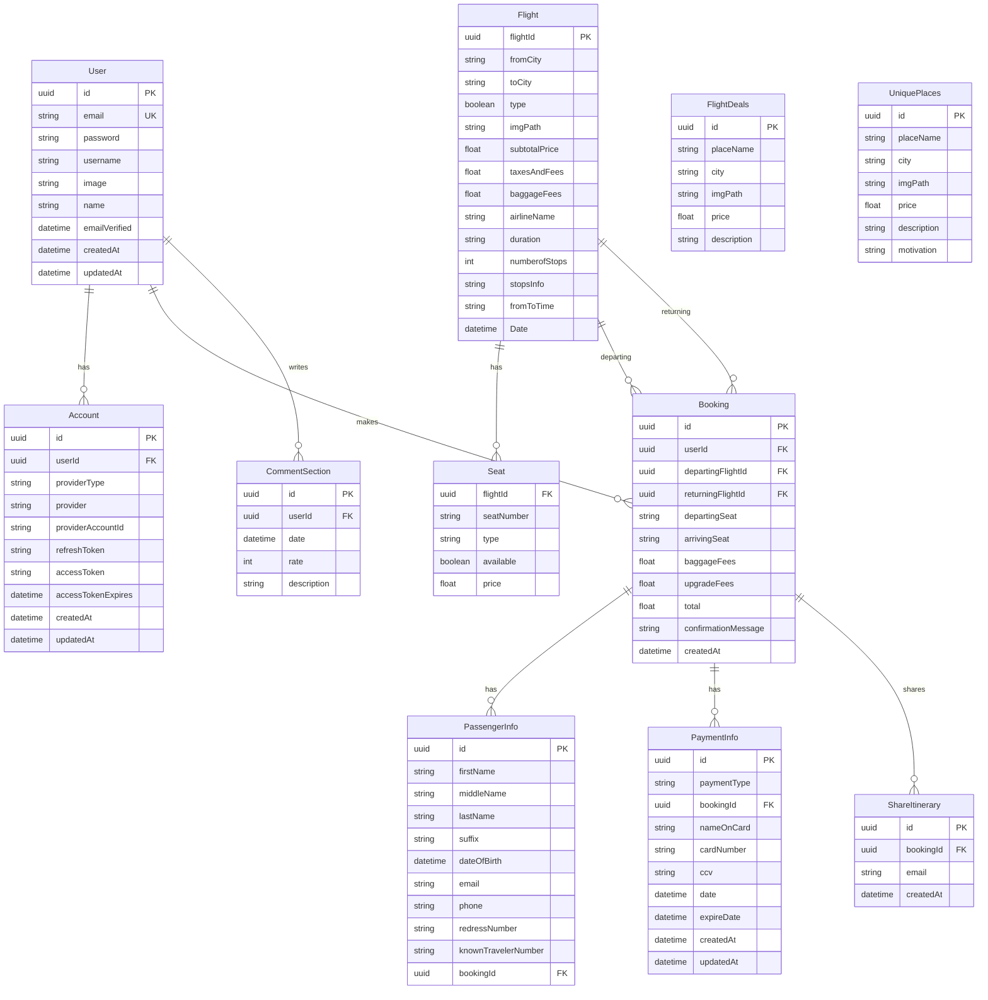

# Entity, Bảng Dữ Liệu, Quan Hệ và Business Logic - Tripma Flight Booking

## 1. Entity và Bảng Dữ Liệu

### 1.1 Flight (Chuyến bay)
**Bảng:** `Flight`
**Primary Key:** `flightId` (UUID)

**Thuộc tính:**
- `flightId` - UUID, Primary Key
- `fromCity` - String (Thành phố đi)
- `toCity` - String (Thành phố đến)
- `type` - Boolean (True = round-trip, False = one-way)
- `imgPath` - String (Đường dẫn ảnh)
- `subtotalPrice` - Float (Giá cơ bản)
- `taxesAndFees` - Float (Thuế và phí)
- `baggageFees` - Float (Phí hành lý)
- `airlineName` - String (Tên hãng hàng không)
- `duration` - String (Thời gian bay, format: "Xh Ymin")
- `numberofStops` - Int (Số điểm dừng)
- `stopsInfo` - String? (Thông tin điểm dừng, optional)
- `fromToTime` - String (Thời gian bay, format: "7:00AM - 4:15PM")
- `Date` - DateTime (Ngày và giờ khởi hành)

---

### 1.2 Seat (Ghế ngồi)
**Bảng:** `Seat`
**Composite Primary Key:** `[flightId, seatNumber]`

**Thuộc tính:**
- `flightId` - UUID (Foreign Key đến Flight)
- `type` - String ("Economy" hoặc "Business")
- `seatNumber` - String (Số ghế)
- `available` - Boolean (Trạng thái có sẵn)
- `price` - Float (Giá ghế)

---

### 1.3 FlightDeals (Ưu đãi chuyến bay)
**Bảng:** `FlightDeals`
**Primary Key:** `id` (UUID)

**Thuộc tính:**
- `id` - UUID, Primary Key
- `placeName` - String (Tên địa điểm)
- `city` - String (Thành phố)
- `imgPath` - String (Đường dẫn ảnh)
- `price` - Float (Giá)
- `description` - String (Mô tả)

---

### 1.4 UniquePlaces (Địa điểm độc đáo)
**Bảng:** `UniquePlaces`
**Primary Key:** `id` (UUID)

**Thuộc tính:**
- `id` - UUID, Primary Key
- `placeName` - String (Tên địa điểm)
- `city` - String (Thành phố)
- `imgPath` - String (Đường dẫn ảnh)
- `price` - Float (Giá)
- `description` - String (Mô tả)
- `motivation` - String (Lý do/động lực)

---

### 1.5 CommentSection (Đánh giá)
**Bảng:** `CommentSection`
**Primary Key:** `id` (UUID)

**Thuộc tính:**
- `id` - UUID, Primary Key
- `userId` - UUID (Foreign Key đến User)
- `date` - DateTime (Ngày đánh giá)
- `rate` - Int (Đánh giá sao)
- `description` - String (Nội dung đánh giá)

---

### 1.6 User (Người dùng)
**Bảng:** `User`
**Primary Key:** `id` (UUID)

**Thuộc tính:**
- `id` - UUID, Primary Key
- `email` - String? (Email, unique, optional)
- `password` - String? (Mật khẩu hash, optional)
- `username` - String? (Tên đăng nhập, optional)
- `image` - String? (Ảnh đại diện, cho Google OAuth)
- `name` - String? (Tên, cho Google OAuth)
- `emailVerified` - DateTime? (Ngày xác nhận email, cho Google OAuth)
- `createdAt` - DateTime (Ngày tạo)
- `updatedAt` - DateTime (Ngày cập nhật)

---

### 1.7 Booking (Đặt vé)
**Bảng:** `Booking`
**Primary Key:** `id` (UUID)

**Thuộc tính:**
- `id` - UUID, Primary Key
- `userId` - UUID? (Foreign Key đến User, optional - cho guest booking)
- `departingFlightId` - UUID (Foreign Key đến Flight)
- `returningFlightId` - UUID? (Foreign Key đến Flight, optional - cho one-way)
- `departingSeat` - String (Số ghế chuyến đi)
- `arrivingSeat` - String? (Số ghế chuyến về, optional)
- `baggageFees` - Float (Tổng phí hành lý)
- `upgradeFees` - Float (Tổng phí upgrade)
- `total` - Float (Tổng giá)
- `confirmationMessage` - String (Mã xác nhận)
- `createdAt` - DateTime (Ngày đặt)

---

### 1.8 PassengerInfo (Thông tin hành khách)
**Bảng:** `PassengerInfo`
**Primary Key:** `id` (UUID)

**Thuộc tính:**
- `id` - UUID, Primary Key
- `firstName` - String (Tên)
- `middleName` - String? (Tên đệm, optional)
- `lastName` - String (Họ)
- `suffix` - String? (Hậu tố, optional)
- `dateOfBirth` - DateTime (Ngày sinh)
- `email` - String (Email)
- `phone` - String (Số điện thoại)
- `redressNumber` - String? (Redress number, optional)
- `knownTravelerNumber` - String? (Known traveler number, optional)
- `bookingId` - UUID (Foreign Key đến Booking)

---

### 1.9 PaymentInfo (Thông tin thanh toán)
**Bảng:** `PaymentInfo`
**Primary Key:** `id` (UUID)

**Thuộc tính:**
- `id` - UUID, Primary Key
- `paymentType` - String (Loại thanh toán - hiện chỉ hỗ trợ "Visa")
- `bookingId` - UUID (Foreign Key đến Booking)
- `nameOnCard` - String (Tên trên thẻ)
- `cardNumber` - String (Số thẻ)
- `ccv` - String (CCV)
- `date` - DateTime (Ngày thanh toán)
- `expireDate` - DateTime (Ngày hết hạn thẻ)
- `createdAt` - DateTime (Ngày tạo)
- `updatedAt` - DateTime (Ngày cập nhật)

---

### 1.10 ShareItinerary (Chia sẻ lịch trình)
**Bảng:** `ShareItinerary`
**Primary Key:** `id` (UUID)

**Thuộc tính:**
- `id` - UUID, Primary Key
- `bookingId` - UUID (Foreign Key đến Booking)
- `email` - String (Email để chia sẻ)
- `createdAt` - DateTime (Ngày chia sẻ)

---

### 1.11 Account (Tài khoản OAuth)
**Bảng:** `Account`
**Primary Key:** `id` (UUID)
**Unique Constraint:** `[provider, providerAccountId]`

**Thuộc tính:**
- `id` - UUID, Primary Key
- `userId` - UUID (Foreign Key đến User)
- `providerType` - String (Loại provider)
- `provider` - String (Tên provider - Google, Facebook, Apple)
- `providerAccountId` - String (Account ID từ provider)
- `refreshToken` - String? (Refresh token, optional)
- `accessToken` - String? (Access token, optional)
- `accessTokenExpires` - DateTime? (Ngày hết hạn access token, optional)
- `createdAt` - DateTime (Ngày tạo)
- `updatedAt` - DateTime (Ngày cập nhật)

---

## 2. Quan Hệ Giữa Các Entity

### 2.1 Flight ↔ Seat
- **Quan hệ:** One-to-Many
- **Flight** có nhiều **Seat**
- **Seat** thuộc về một **Flight**
- **Foreign Key:** `Seat.flightId` → `Flight.flightId`

### 2.2 Flight ↔ Booking
- **Quan hệ:** One-to-Many (hai quan hệ riêng biệt)
- **Flight** có nhiều **Booking** (làm chuyến đi) - relation: "DepartingFlight"
- **Flight** có nhiều **Booking** (làm chuyến về) - relation: "ReturningFlight"
- **Foreign Keys:** 
  - `Booking.departingFlightId` → `Flight.flightId`
  - `Booking.returningFlightId` → `Flight.flightId`

### 2.3 User ↔ Booking
- **Quan hệ:** One-to-Many (Optional)
- **User** có nhiều **Booking**
- **Booking** có thể thuộc về một **User** hoặc null (guest booking)
- **Foreign Key:** `Booking.userId` → `User.id` (nullable)

### 2.4 Booking ↔ PassengerInfo
- **Quan hệ:** One-to-Many
- **Booking** có nhiều **PassengerInfo**
- **PassengerInfo** thuộc về một **Booking**
- **Foreign Key:** `PassengerInfo.bookingId` → `Booking.id`

### 2.5 Booking ↔ PaymentInfo
- **Quan hệ:** One-to-Many
- **Booking** có nhiều **PaymentInfo**
- **PaymentInfo** thuộc về một **Booking**
- **Foreign Key:** `PaymentInfo.bookingId` → `Booking.id`

### 2.6 Booking ↔ ShareItinerary
- **Quan hệ:** One-to-Many
- **Booking** có nhiều **ShareItinerary**
- **ShareItinerary** thuộc về một **Booking**
- **Foreign Key:** `ShareItinerary.bookingId` → `Booking.id`

### 2.7 User ↔ CommentSection
- **Quan hệ:** One-to-Many
- **User** có nhiều **CommentSection**
- **CommentSection** thuộc về một **User**
- **Foreign Key:** `CommentSection.userId` → `User.id`

### 2.8 User ↔ Account
- **Quan hệ:** One-to-Many
- **User** có nhiều **Account** (OAuth providers khác nhau)
- **Account** thuộc về một **User**
- **Foreign Key:** `Account.userId` → `User.id`

---

## 3. Business Logic Quan Sát Được

### 3.1 Flight Search Logic (API: `/api/flights`)

**Input Parameters:**
- `fromCity` - Thành phố đi
- `toCity` - Thành phố đến
- `startDate` - Ngày đi
- `endDate` - Ngày về (optional cho round-trip)
- `adults` - Số người lớn
- `minors` - Số trẻ em
- `type` - Boolean (true = round-trip, false = one-way)

**Logic:**
1. Tính tổng số hành khách: `totalPassengers = adults + minors`
2. Tìm chuyến đi:
   - Filter theo `fromCity`, `toCity`, `type`
   - Filter theo ngày: `Date >= startDate` và `Date < startDate + 24h`
   - Chỉ lấy chuyến có ghế available: `Seats.some(available: true)`
   - Include tất cả ghế available
3. Filter lại: Chỉ giữ chuyến có `availableSeats >= totalPassengers`
4. Nếu round-trip và có endDate:
   - Tìm chuyến về với logic tương tự
   - Đảo ngược `fromCity` và `toCity`
   - Filter theo ngày: `Date >= endDate` và `Date < endDate + 24h`
5. Format response: Chỉ trả về các field cần thiết cho UI

**Validation:**
- Không có validation rõ ràng trong API
- Error handling: try-catch với status 500

---

### 3.2 Seat Fetch Logic (API: `/api/seats/[flightId]`)

**Logic:**
1. Extract `flightId` từ URL path
2. Query tất cả seats của flight:
   - Filter: `flightId` và `available: true`
   - Order by: `seatNumber` ascending
3. Phân loại seats:
   - `businessSeats` = seats với `type === "Business"`
   - `economySeats` = seats với `type === "Economy"`
4. Return JSON với 2 arrays

**Validation:**
- Error handling: try-catch với status 500

---

### 3.3 Booking Creation Logic (API: `/api/booking`)

**Input Parameters:**
- `userId` - Optional (null cho guest booking)
- `departingFlightId` - Required
- `returningFlightId` - Optional (null cho one-way)
- `departingSeat` - Required
- `arrivingSeat` - Optional
- `passengerInfo` - Required object
- `paymentInfo` - Required object

**Validation Logic:**

**1. Required Fields Validation:**
- Check: `departingFlightId`, `departingSeat`, `passengerInfo`, `paymentInfo` phải có

**2. User Validation (nếu có userId):**
- Query User bằng `userId`
- Return error 400 nếu user không tồn tại

**3. Passenger Info Validation:**
- Required fields: `firstName`, `lastName`, `dateOfBirth`, `email`, `phone`, `checkedBags`
- Email format: Regex `/^[^\s@]+@[^\s@]+\.[^\s@]+$/`
- Phone format: Regex `/^\d{11}$/` (11 digits)
- Date of birth: Phải nhỏ hơn ngày hiện tại

**4. Payment Info Validation:**
- Required fields: `paymentType`, `nameOnCard`, `cardNumber`, `ccv`, `expireDate`
- Payment type: Phải là "Visa" (hardcoded)
- Card number format: Regex `/^\d{16}$/` (16 digits)
- CCV format: Regex `/^\d{3}$/` (3 digits)
- Expire date: Phải lớn hơn ngày hiện tại

**5. Flight Validation:**
- Query departingFlight bằng `departingFlightId`
- Return error 400 nếu flight không tồn tại

**6. Price Calculation Logic:**
- **Departing flight:**
  - `departingBaggageFees = departingFlight.baggageFees * checkedBags`
  - Fetch departingSeat details
  - `upgradeFees = departingSeat.price` nếu seat type là "Business", else 0
  - `departingTotalPrice = subtotalPrice + taxesAndFees + departingBaggageFees + upgradeFees`

- **Returning flight (nếu có):**
  - Tương tự departing flight
  - `returningTotalPrice = subtotalPrice + taxesAndFees + returningBaggageFees + returningUpgradeFees`

- **Total:** `totalPrice = departingTotalPrice + returningTotalPrice`

**7. Booking Creation:**
- Generate `confirmationMessage` bằng UUID (12 characters)
- Create Booking record với:
  - `userId` (hoặc null)
  - Flight IDs và seat numbers
  - Calculated fees and total
  - Nested create: PassengerInfo
  - Nested create: PaymentInfo
- Return response với booking details

**Error Handling:**
- Multiple console.log statements với "wow", "wow2", "wow3", "wow4", "wow5" cho debugging
- Return 400 cho validation errors
- Return 500 cho server errors

---

### 3.4 Cities Fetch Logic (API: `/api/cities`)

**Logic:**
1. Query tất cả flights với select `fromCity` và `toCity`
2. Use `distinct` để loại bỏ duplicates
3. Extract unique cities:
   - `fromCities = Set(flights.map(f => f.fromCity))`
   - `toCities = Set(flights.map(f => f.toCity))`
4. Return object với 2 arrays

**Validation:**
- Error handling: try-catch với status 500

---

### 3.5 User Signup Logic (API: `/api/auth/signup`)

**Input Parameters:**
- `email` - Required
- `password` - Required
- `agreeTerms` - Required

**Validation Logic:**
1. **Required fields:** Check email và password có giá trị
2. **Email format:** Check email chứa "@"
3. **Password length:** Password phải >= 8 characters (MIN_PASSWORD_LENGTH = 10)
4. **Terms agreement:** Check `agreeTerms === true`
5. **Email uniqueness:** Query User bằng email, return error nếu đã tồn tại

**User Creation Logic:**
1. Generate username: `{emailBase}_{timestamp}`
   - `emailBase = email.split("@")[0]`
   - `timestamp = Date.now()`
2. Hash password với bcrypt (SALT_ROUNDS = 10)
3. Create User với:
   - `email`
   - `password` (hashed)
   - `username` (generated)
   - `city` = "Cairo" (hardcoded)
   - `country` = "Egypt" (hardcoded)
4. Return success message

**Error Handling:**
- Return 400 cho validation errors
- Return 500 cho server errors

---

### 3.6 Seat Selection Logic (Component: `selectseats.js`)

**State Management:**
- `economySeats` - Array ghế economy
- `businessSeats` - Array ghế business
- `departingSeat` - Ghế đã chọn cho chuyến đi
- `arrivingSeat` - Ghế đã chọn cho chuyến về
- `fetchArriving` - Boolean để xác định đang fetch ghế chuyến đi hay về
- `isOverlayVisible` - Boolean để hiển thị popup upgrade
- `upgradedSeat` - Ghế được upgrade

**Logic:**
1. **Fetch Seats:**
   - Call `/api/seats/{flightId}` khi component mount hoặc khi `fetchArriving` thay đổi
   - Phân loại seats thành economy và business
   - Tính price difference: `businessPrice - economyPrice`

2. **Seat Selection:**
   - Nếu chưa chọn ghế: Chọn ghế luôn
   - Nếu đã chọn ghế:
     - Nếu chọn ghế Business từ Economy: Hiển thị popup upgrade
     - Nếu chọn ghế cùng class: Cập nhật ghế mới

3. **Upgrade Logic:**
   - Popup hiển thị price difference
   - User có thể:
     - Confirm upgrade: Chọn ghế Business
     - Cancel: Giữ ghế Economy cũ

4. **Round-trip Handling:**
   - Sau khi chọn ghế chuyến đi, chuyển sang chọn ghế chuyến về
   - Toggle `fetchArriving` để fetch seats của chuyến về

---

### 3.7 Passenger Info Validation (Component: `passenger.js`)

**Logic:**
- Component nhận `setValid` prop để báo hiệu validation status
- Validation được thực hiện trong `PassengerInfo` component
- Button "Select seats" chỉ enabled khi `isValid === true`

---

### 3.8 Payment Validation (Component: `payment.js`)

**Validation Logic:**
1. **Card validation:**
   - Card number: Regex `/^\d{16}$/` (16 digits)
   - CCV: Regex `/^\d{3}$/` (3 digits)
   - Expire date: Phải có giá trị

2. **Account creation (optional):**
   - Email format: Regex `/^[^\s@]+@[^\s@]+\.[^\s@]+$/`
   - Password: Phải có giá trị nếu email được nhập
   - Logic: `(!email && !password) || (isEmailValid && isPasswordEntered)`

3. **Overall validation:**
   - Tất cả fields phải valid
   - Button "Confirm and pay" chỉ enabled khi valid

---

## 4. Các Vấn Đề và Giới Hạn Quan Sát Được

### 4.1 Security Issues
1. **Payment Info Storage:** Card number được lưu plain text trong database (không encrypted)
2. **Password Hashing:** Sử dụng bcrypt với SALT_ROUNDS = 10 (đủ an toàn)
3. **No Server-side Validation cho nhiều endpoints:** Chỉ validate ở API level
4. **No Rate Limiting:** Không có rate limiting cho API calls
5. **No Input Sanitization:** Không có sanitization cho user inputs

### 4.2 Data Integrity Issues
1. **Hardcoded Values:**
   - `city = "Cairo"` và `country = "Egypt"` khi signup
   - `paymentType` chỉ chấp nhận "Visa"
   - Phone format chỉ chấp nhận 11 digits (không flexible cho quốc gia khác)

2. **No Seat Availability Update:**
   - Khi booking được tạo, seat availability không được cập nhật thành "false"
   - Có thể dẫn đến overbooking

3. **No Transaction Management:**
   - Booking creation không sử dụng database transaction
   - Nếu một phần fail, có thể dẫn đến inconsistent data

### 4.3 Business Logic Issues
1. **Guest Booking Limitations:**
   - Guest không thể xem lại booking sau này
   - Không có cách để recover booking confirmation

2. **Upgrade Seat Logic:**
   - Chỉ tính phí upgrade dựa trên seat price
   - Không tính lại baggage fees cho business class (business class thường có free checked bags)

3. **Price Calculation:**
   - Baggage fees tính cho cả departing và returning flight với cùng số bags
   - Không có logic cho different baggage counts per flight

4. **No Cancellation Policy:**
   - Không có API để hủy booking
   - Không có logic refund

### 4.4 Missing Features
1. **Sign Out:** Không có endpoint hoặc UI để đăng xuất
2. **Your Trips:** Không có API để fetch booking history
3. **Forgot Password:** Không có flow reset password
4. **Email Verification:** Không có logic verify email
5. **Admin Panel:** Không có admin endpoints để manage flights, users, bookings

---

## 5. Entity Relationship Diagram (ERD)

Lỗi do `PK_FK` không hợp lệ trong Mermaid ERD — chỉ được dùng `PK` hoặc `FK` riêng lẻ, không ghép được. Sửa lại:

---

## 6. Tóm Tắt

**Số lượng Entity:** 11 entity chính
- Core entities: Flight, Seat, Booking, User, PassengerInfo, PaymentInfo
- Supporting entities: FlightDeals, UniquePlaces, CommentSection, ShareItinerary, Account

**Số lượng quan hệ:** 8 quan hệ chính
- 1 One-to-Many (Flight ↔ Seat)
- 2 One-to-Many (Flight ↔ Booking)
- 1 One-to-Many Optional (User ↔ Booking)
- 3 One-to-Many (Booking ↔ PassengerInfo, PaymentInfo, ShareItinerary)
- 2 One-to-Many (User ↔ CommentSection, Account)

**Business Logic chính:**
1. Flight Search với availability check
2. Seat Selection với upgrade logic
3. Booking Creation với price calculation
4. User Signup với password hashing
5. Payment Validation với card format check

**Vấn đề chính:**
- Security: Card number không encrypted
- Data Integrity: Seat availability không update sau booking
- Business Logic: Không có cancellation, no transaction management
- Missing Features: Sign out, booking history, admin panel
