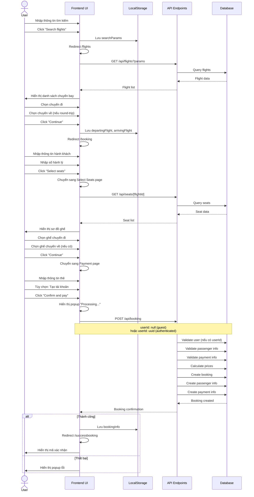

# Tripma User Flows - UML Diagrams

## 1. Activity Diagram - Main Booking Flow (Guest User)

```mermaid
flowchart TD
    Start([Start]) --> HomePage[Trang chủ /]
    HomePage --> SearchInput[Nhập thông tin tìm kiếm]
    SearchInput --> SearchParams{Thành phố đi/đến<br/>Ngày đi/về<br/>Số hành khách}
    SearchParams --> SearchClick[Click Search flights]
    SearchClick --> SaveSearch[Lưu searchParams vào localStorage]
    SaveSearch --> RedirectFlights[Redirect /flights]
    RedirectFlights --> DisplayFlights[Hiển thị danh sách chuyến bay]
    DisplayFlights --> FilterOption{Sử dụng bộ lọc?}
    FilterOption -->|Yes| ApplyFilter[Áp dụng bộ lọc<br/>Giá/Thời gian/Hãng]
    FilterOption -->|No| SelectDeparting
    ApplyFilter --> DisplayFlights
    DisplayFlights --> SelectDeparting[Chọn chuyến đi]
    SelectDeparting --> TripType{Round-trip?}
    TripType -->|Yes| SelectReturning[Chọn chuyến về]
    TripType -->|No| ContinueBtn
    SelectReturning --> ContinueBtn[Click Continue]
    ContinueBtn --> SaveFlights[Lưu departingFlight<br/>và arrivingFlight vào localStorage]
    SaveFlights --> RedirectBooking[Redirect /booking]
    
    RedirectBooking --> PassengerPage[Bạn 1: Passenger Info]
    PassengerPage --> InputPassenger[Nhập thông tin hành khách<br/>Tên, ngày sinh, email, phone]
    InputPassenger --> InputBags[Nhập số hành lý checked bags]
    InputBags --> ValidatePassenger{Validation OK?}
    ValidatePassenger -->|No| InputPassenger
    ValidatePassenger -->|Yes| SelectSeatsBtn[Click Select seats]
    
    SelectSeatsBtn --> SeatsPage[Bạn 2: Select Seats]
    SeatsPage --> FetchSeats[Fetch ghế từ API]
    FetchSeats --> DisplaySeats[Hiển thị sơ đồ ghế<br/>Economy & Business]
    DisplaySeats --> SelectDepartingSeat[Chọn ghế chuyến đi]
    SelectDepartingSeat --> SeatType{Loại ghế?}
    SeatType -->|Cùng class| UpdateSeat[Cập nhật ghế]
    SeatType -->|Khác class| CheckUpgrade{Economy → Business?}
    CheckUpgrade -->|Yes| UpgradePopup[Popup Upgrade Seat]
    CheckUpgrade -->|No| UpdateSeat
    UpgradePopup --> UpgradeDecision{User chọn?}
    UpgradeDecision -->|Upgrade| ConfirmUpgrade[Xác nhận upgrade]
    UpgradeDecision -->|Cancel| CancelUpgrade[Hủy upgrade]
    ConfirmUpgrade --> UpdateBusinessSeat[Cập nhật ghế Business]
    CancelUpgrade --> KeepEconomy[Giữ ghế Economy]
    UpdateBusinessSeat --> ClosePopup[Đóng popup]
    KeepEconomy --> ClosePopup
    UpdateSeat --> ClosePopup
    ClosePopup --> RoundTripSeat{Round-trip &<br/>chưa chọn ghế về?}
    RoundTripSeat -->|Yes| SelectReturningSeat[Chọn ghế chuyến về]
    RoundTripSeat -->|No| ContinueSeats
    SelectReturningSeat --> SelectDepartingSeat
    ContinueSeats[Click Continue] --> PaymentPage
    
    PaymentPage --> [Bạn 3: Payment]
    PaymentPage --> InputCard[Nhập thông tin thẻ<br/>Tên, số thẻ, CCV, ngày hết hạn]
    InputCard --> CreateAccountOption{Tạo tài khoản?}
    CreateAccountOption -->|Yes| InputAccount[Nhập email/password]
    CreateAccountOption -->|No| ValidatePayment
    InputAccount --> ValidatePayment{Validation OK?}
    ValidatePayment -->|No| InputCard
    ValidatePayment -->|Yes| ConfirmPayBtn[Click Confirm and pay]
    
    ConfirmPayBtn --> ProcessingPopup[Popup Processing...]
    ProcessingPopup --> CallAPI[Gọi API POST /api/booking<br/>userId: null]
    CallAPI --> APIResponse{Thành công?}
    APIResponse -->|No| ErrorPopup[Popup lỗi]
    ErrorPopup --> InputCard
    APIResponse -->|Yes| SaveBooking[Lưu bookingInfo vào localStorage]
    SaveBooking --> RedirectSuccess[Redirect /successbooking]
    
    RedirectSuccess --> SuccessPage[Xác nhận đặt vé]
    SuccessPage --> DisplayConfirm[Hiển thị mã xác nhận]
    DisplayConfirm --> DisplaySummary[Xem tóm tắt chuyến bay]
    DisplaySummary --> DisplayPrice[Xem phân tích giá]
    DisplayPrice --> ShareOption{Chia sẻ itinerary?}
    ShareOption -->|Yes| ShareItinerary[Nhập email để chia sẻ]
    ShareOption -->|No| HotelSuggestion
    ShareItinerary --> HotelSuggestion[Xem gợi ý khách sạn]
    HotelSuggestion --> End([End])
```

## 2. Activity Diagram - Authenticated User Flow

```mermaid
flowchart TD
    Start([Start]) --> LoggedIn{Đã đăng nhập?}
    LoggedIn -->|No| AuthFlow[Authentication Flow]
    LoggedIn -->|Yes| HomePage[Trang chủ /]
    
    AuthFlow --> SignIn[Sign In / Sign Up]
    SignIn --> HomePage
    
    HomePage --> Navbar[Navbar hiển thị:<br/>Flights, Hotels, Packages, Your Trips]
    Navbar --> SearchInput[Nhập thông tin tìm kiếm]
    SearchInput --> SearchParams{Thành phố đi/đến<br/>Ngày đi/về<br/>Số hành khách}
    SearchParams --> SearchClick[Click Search flights]
    SearchClick --> SaveSearch[Lưu searchParams vào localStorage]
    SaveSearch --> RedirectFlights[Redirect /flights]
    RedirectFlights --> DisplayFlights[Hiển thị danh sách chuyến bay]
    DisplayFlights --> FilterOption{Sử dụng bộ lọc?}
    FilterOption -->|Yes| ApplyFilter[Áp dụng bộ lọc]
    FilterOption -->|No| SelectDeparting
    ApplyFilter --> DisplayFlights
    DisplayFlights --> SelectDeparting[Chọn chuyến đi]
    SelectDeparting --> TripType{Round-trip?}
    TripType -->|Yes| SelectReturning[Chọn chuyến về]
    TripType -->|No| ContinueBtn
    SelectReturning --> ContinueBtn[Click Continue]
    ContinueBtn --> SaveFlights[Lưu departingFlight<br/>và arrivingFlight vào localStorage]
    SaveFlights --> RedirectBooking[Redirect /booking]
    
    RedirectBooking --> PassengerPage[Bạn 1: Passenger Info]
    PassengerPage --> InputPassenger[Nhập thông tin hành khách]
    InputPassenger --> InputBags[Nhập số hành lý]
    InputBags --> ValidatePassenger{Validation OK?}
    ValidatePassenger -->|No| InputPassenger
    ValidatePassenger -->|Yes| SelectSeatsBtn[Click Select seats]
    
    SelectSeatsBtn --> SeatsPage[Bạn 2: Select Seats]
    SeatsPage --> FetchSeats[Fetch ghế từ API]
    FetchSeats --> DisplaySeats[Hiển thị sơ đồ ghế]
    DisplaySeats --> SelectDepartingSeat[Chọn ghế chuyến đi]
    SelectDepartingSeat --> SeatType{Loại ghế?}
    SeatType -->|Cùng class| UpdateSeat[Cập nhật ghế]
    SeatType -->|Khác class| CheckUpgrade{Economy → Business?}
    CheckUpgrade -->|Yes| UpgradePopup[Popup Upgrade Seat]
    CheckUpgrade -->|No| UpdateSeat
    UpgradePopup --> UpgradeDecision{User chọn?}
    UpgradeDecision -->|Upgrade| ConfirmUpgrade[Xác nhận upgrade]
    UpgradeDecision -->|Cancel| CancelUpgrade[Hủy upgrade]
    ConfirmUpgrade --> UpdateBusinessSeat[Cập nhật ghế Business]
    CancelUpgrade --> KeepEconomy[Giữ ghế Economy]
    UpdateBusinessSeat --> ClosePopup[Đóng popup]
    KeepEconomy --> ClosePopup
    UpdateSeat --> ClosePopup
    ClosePopup --> RoundTripSeat{Round-trip &<br/>chưa chọn ghế về?}
    RoundTripSeat -->|Yes| SelectReturningSeat[Chọn ghế chuyến về]
    RoundTripSeat -->|No| ContinueSeats
    SelectReturningSeat --> SelectDepartingSeat
    ContinueSeats[Click Continue] --> PaymentPage
    
    PaymentPage --> [Bạn 3: Payment]
    PaymentPage --> InputCard[Nhập thông tin thẻ]
    InputCard --> ValidatePayment{Validation OK?}
    ValidatePayment -->|No| InputCard
    ValidatePayment -->|Yes| ConfirmPayBtn[Click Confirm and pay]
    
    ConfirmPayBtn --> ProcessingPopup[Popup Processing...]
    ProcessingPopup --> CallAPI[Gọi API POST /api/booking<br/>userId: có giá trị]
    CallAPI --> APIResponse{Thành công?}
    APIResponse -->|No| ErrorPopup[Popup lỗi]
    ErrorPopup --> InputCard
    APIResponse -->|Yes| SaveBooking[Lưu bookingInfo vào localStorage<br/>Lưu vào database]
    SaveBooking --> RedirectSuccess[Redirect /successbooking]
    
    RedirectSuccess --> SuccessPage[Xác nhận đặt vé]
    SuccessPage --> DisplayConfirm[Hiển thị mã xác nhận]
    DisplayConfirm --> DisplaySummary[Xem tóm tắt chuyến bay]
    DisplaySummary --> DisplayPrice[Xem phân tích giá]
    DisplayPrice --> ShareOption{Chia sẻ itinerary?}
    ShareOption -->|Yes| ShareItinerary[Nhập email để chia sẻ]
    ShareOption -->|No| HotelSuggestion
    ShareItinerary --> HotelSuggestion[Xem gợi ý khách sạn]
    HotelSuggestion --> ViewTripsOption{Xem Your Trips?}
    ViewTripsOption -->|Yes| YourTrips[Your Trips - 404]
    ViewTripsOption -->|No| End([End])
    YourTrips --> End
```

## 3. Activity Diagram - Authentication Flow

```mermaid
flowchart TD
    Start([Start]) --> HomePage[Trang chủ /]
    HomePage --> Navbar[Navbar hiển thị]
    Navbar --> AuthOption{Chọn authentication?}
    AuthOption -->|Sign Up| SignUpFlow
    AuthOption -->|Sign In| SignInFlow
    AuthOption -->|Không| GuestFlow[Guest Booking Flow]
    
    SignUpFlow --> ClickSignUp[Click Sign Up trên navbar]
    ClickSignUp --> SignUpModal[Modal Sign Up hiển thị]
    SignUpModal --> InputEmail[Nhập email]
    InputEmail --> InputPassword[Nhập password]
    InputPassword --> CheckTerms{Checkbox terms?}
    CheckTerms -->|No| ShowTermsError[Hiển thị lỗi]
    ShowTermsError --> InputEmail
    CheckTerms -->|Yes| CheckAlerts{Checkbox deal alerts?}
    CheckAlerts -->|Yes| EnableAlerts[Bật deal alerts]
    CheckAlerts -->|No| DisableAlerts[Tắt deal alerts]
    EnableAlerts --> CreateAccountBtn
    DisableAlerts --> CreateAccountBtn[Click Create account]
    CreateAccountBtn --> CallSignupAPI[Gọi API POST /api/auth/signup]
    CallSignupAPI --> SignupResponse{Thành công?}
    SignupResponse -->|No| ShowSignupError[Hiển thị lỗi]
    ShowSignupError --> InputEmail
    SignupResponse -->|Yes| CloseSignUpModal[Đóng modal]
    CloseSignUpModal --> UpdateSession[Cập nhật session]
    UpdateSession --> AuthenticatedUser([User đã đăng nhập])
    
    SignInFlow --> ClickSignIn[Click Sign In trên navbar]
    ClickSignIn --> SignInModal[Modal Sign In hiển thị]
    SignInModal --> InputSignInEmail[Nhập email]
    InputSignInEmail --> InputSignInPassword[Nhập password]
    InputSignInPassword --> SignInBtn[Click Sign in]
    SignInBtn --> CallSignInAPI[Gọi API /api/auth/[...nextauth]]
    CallSignInAPI --> SignInResponse{Thành công?}
    SignInResponse -->|No| ShowSignInError[Hiển thị lỗi]
    ShowSignInError --> InputSignInEmail
    SignInResponse -->|Yes| CloseSignInModal[Đóng modal]
    CloseSignInModal --> UpdateSession[Cập nhật session]
    UpdateSession --> AuthenticatedUser([User đã đăng nhập])
    
    GuestFlow --> SearchFlights[Tìm kiếm chuyến bay]
    SearchFlights --> GuestBooking([Guest Booking Flow])
```

## 4. Sequence Diagram - Booking Process



## 5. Use Case Diagram

```mermaid
flowchart TD
    User((Guest User)) --> SearchFlights[Tìm kiếm chuyến bay]
    User --> ViewFlights[Xem danh sách chuyến bay]
    User --> FilterFlights[Lọc chuyến bay]
    User --> SelectFlight[Chọn chuyến bay]
    User --> BookFlight[Đặt vé]
    User --> SelectSeats[Chọn ghế]
    User --> MakePayment[Thanh toán]
    User --> ViewConfirmation[Xem xác nhận]
    
    AuthUser((Authenticated User)) --> SearchFlights
    AuthUser --> ViewFlights
    AuthUser --> FilterFlights
    AuthUser --> SelectFlight
    AuthUser --> BookFlight
    AuthUser --> SelectSeats
    AuthUser --> MakePayment
    AuthUser --> ViewConfirmation
    AuthUser --> ViewTrips[Xem lịch sử đặt vé]
    AuthUser --> ReceiveAlerts[Nhận deal alerts]
    AuthUser --> SignUp[Đăng ký]
    AuthUser --> SignIn[Đăng nhập]
    
    User --> SignUp
    User --> SignIn
    
    System((System)) --> ProcessBooking[Xử lý đặt vé]
    System --> ValidatePayment[Validate thanh toán]
    System --> GenerateConfirmation[Tạo mã xác nhận]
    System --> SaveBooking[Lưu đặt vé]
```



## Notes

- **Guest User**: Có thể đặt vé mà không cần đăng ký tài khoản
- **Authenticated User**: Đã đăng nhập, booking được lưu vào tài khoản
- **Authentication Flow**: Tùy chọn, không bắt buộc
- **Sign Out**: Chưa được triển khai trong code
- **Your Trips**: Chưa được triển khai (404)
- **Hotels/Packages**: Chưa được triển khai (404)
